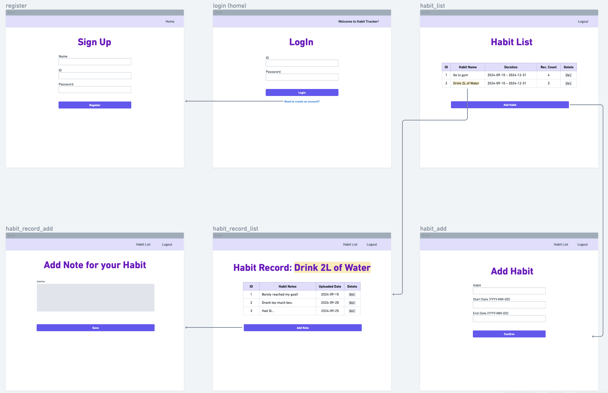

# Habit Management App

## Overview
A web application that allows users to manage and track their habits effectively, providing functionality to create habits, record progress, and add notes for each entry.

*This project is for practicing database creation with Node.js. *

&nbsp;
## Used Modules

- **Node.js**
- **Express**
- **EJS**
- **Express-session**
- **Cookie-parser**
- **Moment**
- **Nodemon**
- **SQLite3**

&nbsp;
&nbsp;

## Project Requirements

한국어 (korean)

- 회원가입 및 로그인 기능
- 회원 별로 습관을 관리 해야 한다.
- 습관 목록을 조회할 수 있어야 하고, 습관을 추가할 수 있어야 한다
- 습관 별로 기록을 관리할 수 있어야 한다.
- 습관 기록에는 메모를 할 수 있는 기능이 필요하다.

### 1. User Authentication
- Implement user registration and login functionality.

### 2. Habit Management
- Users can manage their own habits.
- Users can view a list of their habits.
- Users can add new habits.

### 3. Habit Tracking
- Users can manage records for each habit.
- The habit tracking feature includes a memo functionality for each record.

&nbsp;

&nbsp;

# Entity-Relationship Diagram

&nbsp;
# Sequence Diagram
[seq.diagram](https://viewer.diagrams.net/?border=0&tags=%7B%7D&lightbox=1&highlight=0000ff&edit=_blank&layers=1&nav=1#R%3Cmxfile%3E%3Cdiagram%20name%3D%22Page-1%22%20id%3D%22hoKtp5oZKq1pvJWZhLWU%22%3E7V1db6M4FP01aDIPjfgM8JjP2ZV2tNV0pH1c0eAm7BCcAdK08%2BvXNpiA7SSkwZRmkHa05MZgBx%2Ffc%2B%2B5hirGdPPyJfa266%2FQB6Giq%2F6LYswUXdcMZ4T%2Bhy2vuUVV9cyyigM%2Fs6kHw0PwC9CGuXUX%2BCDJbZkphTBMg23VuIRRBJZpxebFMdxXmz3B0K8Ytt4KVIaBDQ9LLwRcs38CP11nVscqtf4DBKs17Rn9wOybjUcb54Zk7flwXzIZc8WYxhCm2dHmZQpCfPeq92Vx5NtiYDGI0jonfHdN243nSfTtx%2FOvZAG%2Bru7md8Vwn71wl%2F9kZT5RJo7iTPGBO1Mm6GCquGNlouKDsao46kCZzxRHU8ak0RgffM5%2FZvpK7x36xVt8uNuEfwVPIAwi9GmyBXGwASmI0Tdhbr4%2F2Cb7dZCCh623xKfuEayQbZ1uQvRJQ4doolMPnYJPV9FnP4bb7168AmluWMIw9LZJ8EiGgS0xWO7iJHgG30CSAQxb4S7FXU8L4GDjFsYpsiRpjPrARuAl6R4k6HASgf3cR%2BCgP9CeKPro5w7P3wQUXxQmxRiXvg8fYensQyN9yjQ6coFnEKcBguWRU9EPfAZ%2B5Vy10iCGu8jnWtgzciECANQBeDmKLa1ALFrrAKLJil9Rk%2FwEM0fRa%2FXj%2FrBiCqCty6tFpYvDy5fpqrj0AcnoIAfzRcDWeGCzAC3BagvRfJNBWBPFmjE4RahYwxWMvLCMVCGCUoLFBwz9hMd%2BDy8xvE45p%2BOosyqos0Wo40HnWvIwpwuc6Qy7TifzocifIh9KPKlDnKk7VxzrFC7pxIzDYBUh2yNMU7hBXyQIaOkYMxzGJ%2BoRz3DkU8tjCJc%2FaLOcVp0KkhD4qqihCDFmBRqKmc8daT7L2ads2PiCb5pWROTUbZ9ZxDwAYhB6KXLoVboXzGd%2B6j1e3Qfg3Gli5NArJHAXL0F%2BEgOKYhTX4MTofdON%2ByaryoiaXs85OfJ8kykM9JD3QbEeDvQMxZ0OvO12%2BF%2FSh3K3jOfToVyRr1wYy1kjedC1enf5ceB1yv3UDeWcet5SY4m7QcyNBJhbxGAVJBgxunqH%2Fn2Zf39T7CaI09qNy3JTFufUyaJqhGqWlFBNc6vI0Ix6sRq6v95rqVnuFI7344gJ%2BwCi7IoNB4K2AGUjb4OJMkwpW1LLKlvM5e9Rt6Imt41JqzYmDTmYtBlMstTXFCZdVdiPZEw6wkDRNfF%2FWBp0FcccJD9DFNv1geItM%2FkZzU%2BvroJOiH5uHyl%2BHHyd8j8NR4quKQ1ztLuTkeL93w8fOVRsnkLVKrXp7Pw0FtZZwn6EFMqdXQiDx0aZrXt5QqHGFzGwQoP6HHwqgewTz8NnGLUB%2F6%2BzEbMmWIq6YC2yEXyDS5HX3%2FHt2sKkg%2FeruA%2FveL94HTrx0JrW1V1CXNcg8jaA%2BHxiOXzaekmyh7HP38jf2KlxM8yquQ05NWNkCfup59RM68wopTs1gRKtL0K4CiJkJRsL5orrkPLYTJmYZNOBTQpmZKuBOyXNim8nirNQXLfIgaPHZPuxs%2BDmkckgxlDbyVhpP%2FWQyQYF3CilI1MkNNdCZg7IMcmRp8pEV8Yz5RZEwsahyCLEcIeWLgeMjExT6qpm%2BDc6P1bpkBTp0H1G29GM9kwEyHrhmkVhW2LyygvQ5QSDuL5ORMvCe9VytCwQRs%2BJ9UXEgjf92KTUnnGHc45QblnlPzrrd%2BpQVWl82HTMU3OXz9Uxj31VzMOO8gjBHC5EG8KnpwRIIiGRrFqKi%2FjIhw3FexFMFAoxAromCaCMK6X91A2CzoxSdgREnfwxUafgqBHxlX7wjA6Jh9SGR3ULdLhcA4QkDqnZVR5jehHBdfUhmfufwwQkSQCjYa6WkMHl0smIOu7Seces706upiogV0dArvK2zuq80hkDP4hxRJq5GAcxqEV41KQZFyLXsTJ2KcvOBpgovccgvS1ZqgVyNCVJVSw5mhdJVSw5cqPsAjnShKxKjgSGl5BjLxOc4karJW60ruJGbpTSuZEX8MvpGwFhJ9I3S8Qw7aZvOi87HxbpDG%2BEzh%2FSoKoyytGyZeva5LENREHmQXyuQUfEWHrYY6zSBNDBZ%2FGBxYANKj5TDyIaAVoijlkZcbFHZ2zhp%2FZqdX8mGPnILijHojrUXVNrhjYZOrPYgKipCg8jXdJ%2BalZ4RmdG2QnaFGjtNZcVXpsqkU1muO7jOreI2iajPQ4QsgqTzG4L66Joj%2BP8TkZ7Aj2%2BPhv81nt73yWxsdx2Ehvaz9sSG26UnYC6aHM6TWwWnu%2F36U1T6c1I2vY3VdjP29IbbpTS0xu%2B4sKlNxkUO5HkjERboFtOcgRKvZie0HIdkXVLM4Senk7RE4Viw%2FQ0akl3G12lu3Gj7AI90UXUCD31pamT%2FGSzj2xI4ifaz9v4iRulbH4yxNuzi9JU1wjKfv8t2oYuWLXiyh1ZvES2om%2Bdyg8QOLEEYCA246twpwpvbA1PQI1Z2obz2ELom5D9G%2BRdLa5G9bbpocFYx%2B3xiUZJQsTf5vPfC21Xb6W2W9pKbV%2FEk%2BxWam6UneBJvkbQV1bbEyDslgQI%2ByoBghtlJ5ArfFCAkiqamQUCcbaZo5cYzoVwjqRSBRvCOReVKtjVwo1SegjHlyFEEoNijNF1KOA6Ecw5oufHLKvVYE60Of14MMfxzJ%2BzarGytAvWzehnhoO9zHIofY5xHXOiVuusfJWIXA2dlUdpGjmFvo3vyL6vPki7IkhzJT1VxAZp7kVPFbFBGjfKTlCdQGuvi%2FO%2BGnoZbE3mFQKuJHHDYJ4edy8TN9jFVVPcaBe2onfFvME98xBWB%2BfV6MX5Jv1KuCRX4d6SISlXcS8qQ7G5CjfKTqwEUeFFuBJEhZeTDwJxu8SOJEFYZvz8GwQyzeZFrqwKDOu%2FL9sLw67Mth%2FSp2vsoryoQ1K3K3obuOiRBnnZkclXB%2Bq7hIzMhNR4Q0u5BU7TVFlbx9m386kX7R1nWY0fZxdozdSvorUjr0TIqq09sUklNk1tSfErOnobtfHjlM5t4qcmuLJtZ8lNU0XaX8vsJhLn30n7431Pr%2B41ru5pqqRKFivvFR29Td%2Fjx9kJIuXrDJUqbC3RREyQfUn20pBQk6T4cSHhybeInw8JuXF2Ask13kiUpDH8UfzBPL1KiPQV0ZuXFf6jgcOnEO6Xay9Oh14UwRTNNIz%2Bxed4OWZD8IT9deg9gvAeJgFugMxxRnPZO49APH8G2auPGiLdO4P1KzznmgLK1dhUvQbn4rVc%2FCHAbKYOf0%2FRmP8P%3C%2Fdiagram%3E%3C%2Fmxfile%3E)

&nbsp;

# UI Design & Prototype

korean

* [프로토타입 보기 (KR)](https://whimsical.com/habit-web-THkqG3nynXrMxTGv31HkAd)

* [요구사항 명세서 pdf](habbit-requirement.pdf)

&nbsp;

* [view prototype (EN)](https://whimsical.com/habit-web-eng-Fq6SJpY2R9dFP3CX86zYcD@or4CdLRbgroUYs7q3E5gZn2vyaZihJaovEpzuq9dR)

&nbsp;

## Installation
1. Clone the repository
~~~bash
git clone https://github.com/est22/habit_web
~~~
2. Navigate to the project directory:
~~~bash
cd habit-management-app
~~~
3. Install dependencies:
~~~bash
npm i express ejs express-session cookie-parser moment nodemon
~~~
4. Start the application: 
~~~bash
npm run dev
~~~

&nbsp;
&nbsp;

