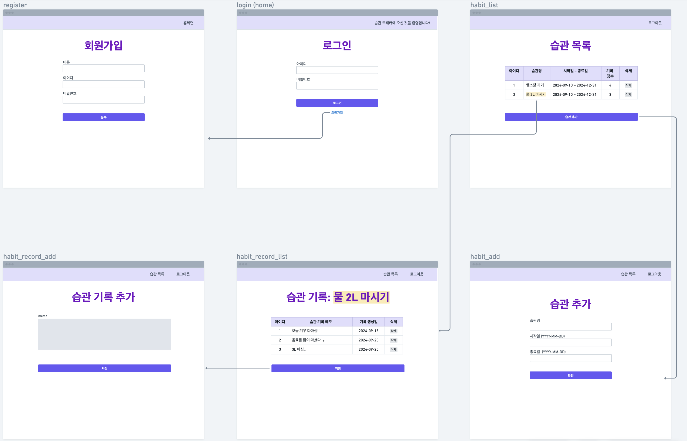

# Habit Management App

## Overview
A web application that allows users to manage and track their habits effectively, providing functionality to create habits, record progress, and add notes for each entry.

*This project is for practicing database creation with Node.js. *

&nbsp;
## Used Modules

- **Node.js**
- **Express**
- **EJS**
- **Express-session**
- **Cookie-parser**
- **Moment**
- **Nodemon**
- **SQLite3**

&nbsp;
&nbsp;

## Project Requirements

한국어 (korean)

- 회원가입 및 로그인 기능
- 회원 별로 습관을 관리 해야 한다.
- 습관 목록을 조회할 수 있어야 하고, 습관을 추가할 수 있어야 한다
- 습관 별로 기록을 관리할 수 있어야 한다.
- 습관 기록에는 메모를 할 수 있는 기능이 필요하다.

### 1. User Authentication
- Implement user registration and login functionality.

### 2. Habit Management
- Users can manage their own habits.
- Users can view a list of their habits.
- Users can add new habits.

### 3. Habit Tracking
- Users can manage records for each habit.
- The habit tracking feature includes a memo functionality for each record.

&nbsp;

&nbsp;

# Entity-Relationship Diagram

&nbsp;
# Sequence Diagram

&nbsp;

# UI Design & Prototype

korean

* [프로토타입 보기 (KR)](https://whimsical.com/habit-web-THkqG3nynXrMxTGv31HkAd)

* [요구사항 명세서 pdf](habbit-requirement.pdf)

&nbsp;

* [view prototype (EN)](https://whimsical.com/habit-web-eng-Fq6SJpY2R9dFP3CX86zYcD@or4CdLRbgroUYs7q3E5gZn2vyaZihJaovEpzuq9dR)

&nbsp;

## Installation
1. Clone the repository
~~~bash
git clone https://github.com/est22/habit_web
~~~
2. Navigate to the project directory:
~~~bash
cd habit-management-app
~~~
3. Install dependencies:
~~~bash
npm i express ejs express-session cookie-parser moment nodemon
~~~
4. Start the application: 
~~~bash
npm run dev
~~~

&nbsp;
&nbsp;

